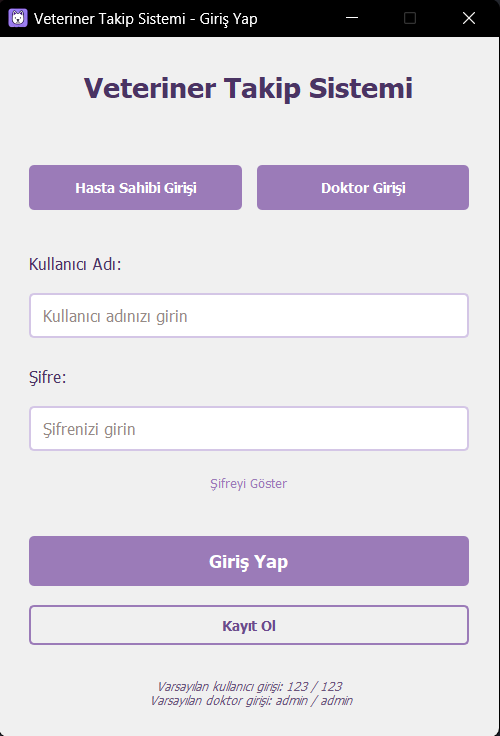
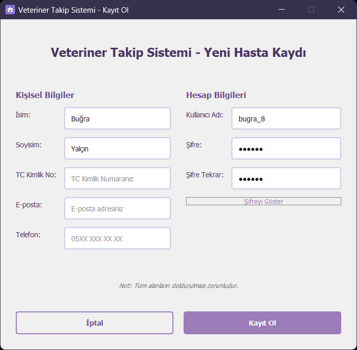
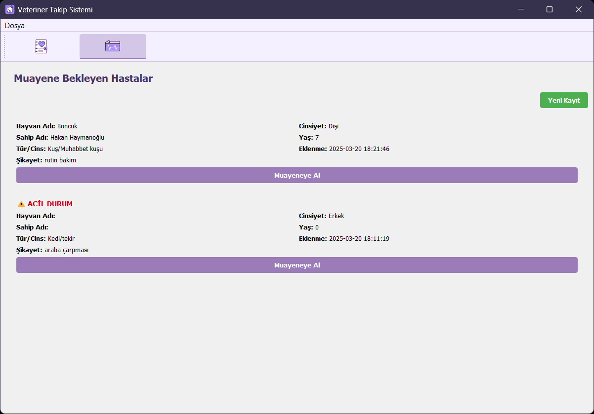
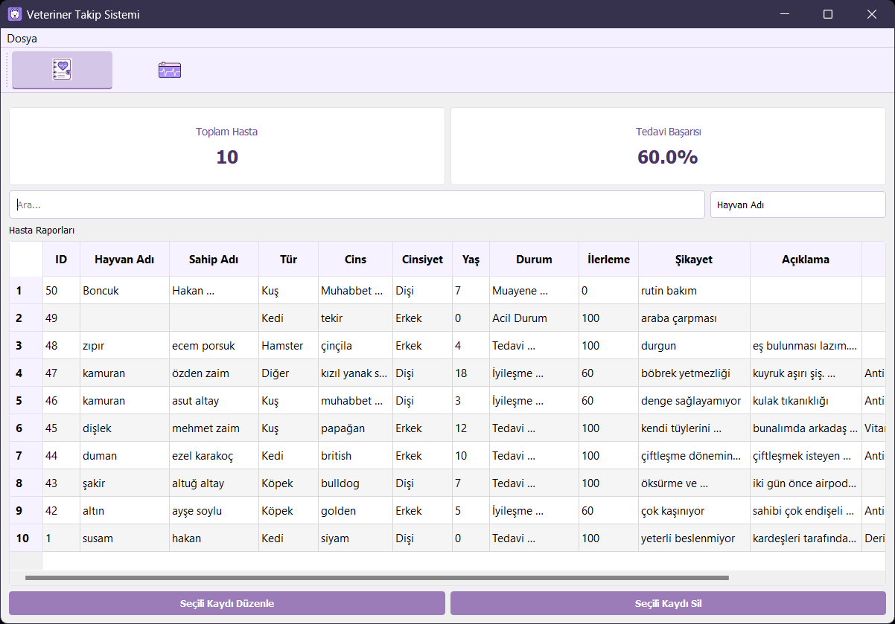
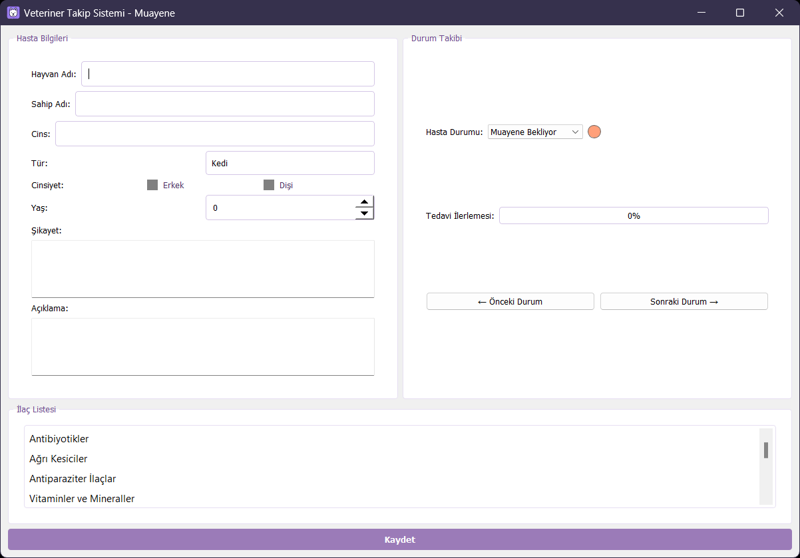
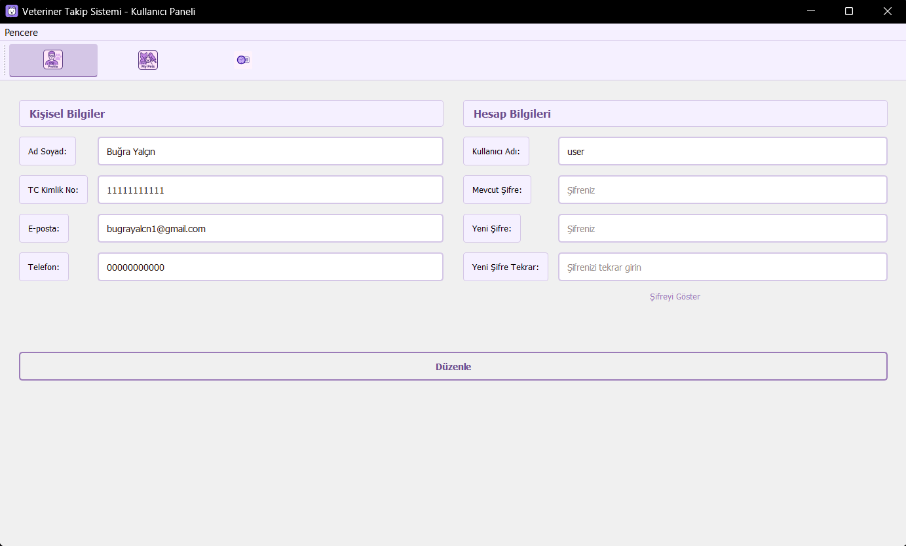
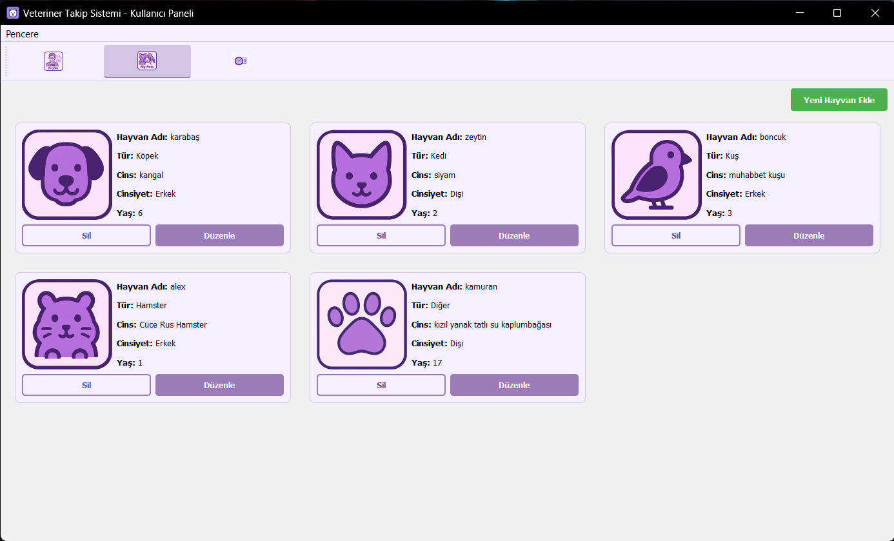
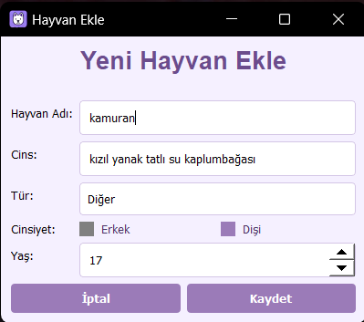
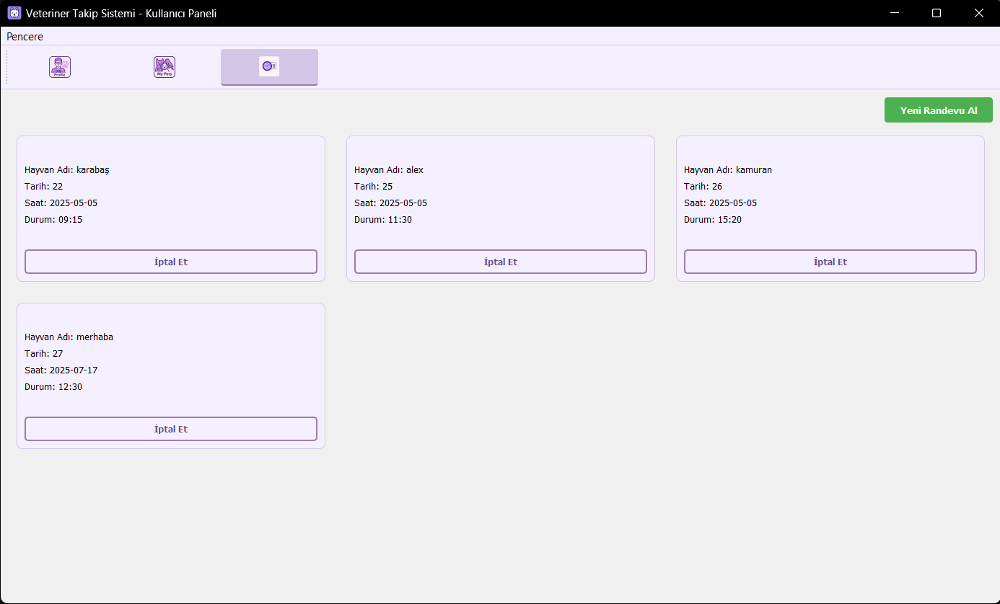
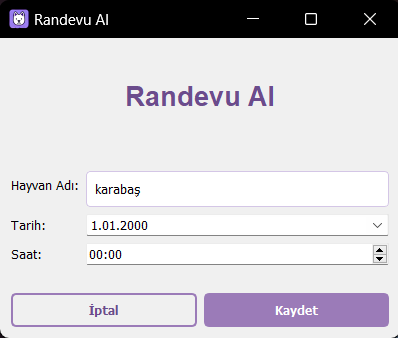

# Veterinerlik Uygulaması


**Veterinerlik Uygulaması**, Python ve PyQt5 ile geliştirilmiş, modern ve kullanıcı dostu bir masaüstü takip sistemidir. Hasta kayıt yönetimi, randevu takibi, raporlama ve kullanıcı yetkilendirme gibi klinik operasyonlarını basitleştirir.

---

## İçindekiler

1. [Özellikler](#özellikler)
2. [Teknolojiler ve Bağımlılıklar](#teknolojiler-ve-bağımlılıklar)
3. [Kurulum ve Çalıştırma](#kurulum-ve-çalıştırma)
4. [Kullanım Rehberi](#kullanım-rehberi)
5. [Veritabanı Tasarımı](#veritabanı-tasarımı)
6. [Ekran Görüntüleri](#ekran-görüntüleri)
7. [Proje Yapısı](#proje-yapısı)
8. [Katkıda Bulunma](#katkıda-bulunma)
9. [Lisans](#lisans)

---

## Özellikler

* **Hasta Kayıt Yönetimi**: Yeni hasta ekleme, düzenleme, silme ve arama.
* **Randevu Takip**: Tarih, saat ve hasta bilgilerini içeren randevu oluşturma, güncelleme ve iptal.
* **Raporlama**: Günlük/haftalık randevu raporları, hasta istatistikleri ve detaylı PDF çıktısı.
* **Kullanıcı Yetkilendirme**: Admin ve Personel rollerine göre erişim kontrolü.
* **Veritabanı**: SQLite3 tabanlı, ilişkisel yapı.
* **Modüler Kod**: Ayrılmış `ui`, `utils`, `windows` paketleri.
* **Loglama**: Uygulama içi hata ve işlem kayıtları.

## Teknolojiler ve Bağımlılıklar

* **Python**: 3.8 veya üzeri
* **PyQt5**: GUI geliştirme
* **SQLite3**: Hafif ilişkisel veritabanı
* **reportlab**: PDF rapor oluşturma
* **pytest**: Birim testleri

## Kurulum ve Çalıştırma

1. **Depoyu klonlayın**:

   ```bash
   git clone https://github.com/k0laa/Veterinerlik_Uygulamasi.git
   cd Veterinerlik_Uygulamasi
   ```
2. **Sanal ortam oluşturun** _(opsiyonel)_:

   ```bash
   python -m venv venv
   venv\\Scripts\\activate # Windows
   ```
   ```bash
   python -m venv venv
   source venv/bin/activate  # Linux/macOS
   ```
3. **Bağımlılıkları yükleyin**:

   ```bash
   pip install -r requirements.txt
   ```
4. **Uygulamayı başlatın**:

   ```bash
   python main.py
   ```

## Kullanım Rehberi

### Giriş Ekranı

* Kayıtlı bir kullanıcı adı ve şifre ile giriş.
* Varsayılan Admin: `admin` / `admin`
* Varsayılan Kullanıcı: `123` / `123`

### Hasta İşlemleri

1. **Hasta Yönetimi** menüsüne gidin.
2. Yeni hasta eklemek için "Yeni Hasta" butonuna tıklayın.
3. Varolan hastaları listeden seçerek düzenleyin veya silin.

### Randevu İşlemleri

1. **Randevular** sekmesine geçin.
2. "Randevu Ekle" ile yeni randevu oluşturun.
3. Randevuları tarih/saat bazında listeleyin, düzenleyin veya silin.

### Raporlar

* **PDF Rapor**: Seçilen tarih aralığı için randevu ve hasta raporu üretir.
* **CSV Çıktısı**: Ham veri export işlemi.

**Veritabanı Tasarımı**

* **kullanicilar** tablosu: (id, kullanici_adi, sifre_hash, tuz, rol, ad_soyad, email, son_giris, tc_kimlik, telefon)
* **hastalar
  ** tablosu: (id, hayvan_adi, sahip_adi, tur, cinsiyet, yas, durum, ilerleme, aciklama, ilaclar, ekleyen_id, ekleme_tarihi, cins, sikayet, tarih, saat)
* **randevular** tablosu: (id, hasta_id, tarih, saat, tip, notlar, durum)
* **yetkiler** tablosu: (rol, hasta_ekle, hasta_duzenle, hasta_sil, rapor_goruntule, kullanici_yonet)
* **pets** tablosu: (id, hayvan_adi, tur, cins, cinsiyet, yas, ekleyen_

## Ekran Görüntüleri

### Giriş Ekranı



### Kayıt Ol Ekranı



## Doktor Panelleri :

### Bekleyen Hastalar



### Raporlar



### Yeni Hasta Ekleme ve Düzenleme



## Hayvan Sahibi Panelleri :

### Profil



### Hayvanlarım



### Hayvan Ekleme



### Randevularım



### Randevu Oluşturma



## Proje Yapısı

```
Veterinerlik_Uygulamasi/
├── main.py                               # Uygulama başlangıç noktası
├── Windows/                              # Pencerelerin ana sınıfları ve fonksiyonları
│   ├── add_appointment_window.py         
│   ├── add_pet_window.py                 
│   ├── appointment_window.py             
│   ├── doctor_main_window.py             
│   ├── login_window.py                   
│   ├── owner_window.py                   
│   └── singup_window.py                  
├── ui/                                   # Tüm dizayn dosyaları
│   ├── tabs/                             # Sekme dizaynları
│   │   ├── bekleyen_hastalar_tab.py      
│   │   ├── hayvanlarim_tab.py            
│   │   ├── profil_tab.py                 
│   │   ├── randevular_tab.py             
│   │   └── raporlar_tab.py               
│   ├── widgets/                          # bileşen dizaynları
│   │   ├── durum_takip.py      
│   │   ├── form_elements.py    
│   │   ├── hasta_karti.py      
│   │   ├── hayvan_karti.py     
│   │   ├── ilac_listesi.py     
│   │   ├── menu.py             
│   │   ├── randevu_karti.py    
│   │   └── statistics.py 
│   ├── windows/                          # Pencerelerin dizaynları
│   │   ├── add_appointment_window_ui.py         
│   │   ├── add_pet_window_ui.py                 
│   │   ├── appointment_window_ui.py             
│   │   ├── doctor_main_window_ui.py             
│   │   ├── login_window_ui.py                   
│   │   ├── owner_window_ui.py                   
│   │   └── singup_window_ui.py      
│   ├── styles.py                          # CSS stilleri
├── utils/                   # Yardımcı modüller
│   └── database.py          # Veritabanı işlemleri
├── requirements.txt         # Python bağımlılıkları
└── LICENSE                  # Lisans bilgisi
```

## Katkıda Bulunma

Bu projeye katkıda bulunmak isterseniz, çekinmeden `pull request` gönderebilirsiniz. Herhangi bir hata veya öneri için
[issue](https://github.com/k0laa/Veterinerlik_Uygulamasi/issues) açabilirsiniz.

## Lisans

Bu proje [MIT Lisansı](LICENSE) ile lisanslanmıştır.


